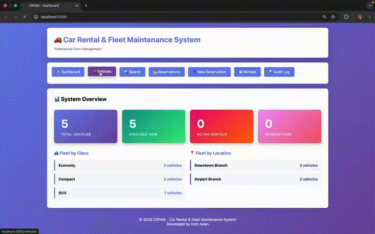

# Car Rental & Fleet Maintenance System (CRFMS)

A comprehensive, production-ready car rental and fleet maintenance management system built with Python, following SOLID principles and domain-driven design patterns.

## 🎥 Demo Video



**Live demonstration** of the web interface showing:
- 📊 Dashboard with real-time statistics
- 🚗 Vehicle inventory management  
- 🔍 Advanced search functionality
- 📋 Reservation and rental tracking
- 📝 Complete audit logging

## 📋 Project Overview

This system supports customers, branch agents, and fleet managers in managing the complete car rental lifecycle including:

- **Reservations**: Create, modify, and cancel vehicle reservations
- **Vehicle Management**: Track vehicle availability, status, and maintenance
- **Rental Operations**: Idempotent pickup and return operations with conflict detection
- **Dynamic Pricing**: Composable pricing rules with base rates, add-ons, late fees, mileage overages, and seasonal surcharges
- **Maintenance Tracking**: Automated maintenance scheduling with 500km threshold alerts
- **Billing & Payments**: Pre-authorization, payment processing, and invoice management
- **Notifications**: Automated notifications for confirmations, reminders, and payment status

## 🏗️ Architecture

### Domain-Driven Design

The system follows clean architecture principles with clear separation of concerns:

```
CRFMS/
├── domain/              # Core business entities and logic
│   ├── models.py        # Entities (Customer, Vehicle, Reservation, etc.)
│   ├── value_objects.py # Immutable values (Money, FuelLevel, Kilometers)
│   └── clock.py         # Time abstraction for testability
├── services/            # Use case orchestration
│   ├── inventory_service.py
│   ├── reservation_service.py
│   ├── rental_service.py
│   ├── maintenance_service.py
│   ├── accounting_service.py
│   └── pricing_policy.py  # Strategy pattern for pricing
├── adapters/            # External service interfaces
│   ├── notification_port.py
│   └── payment_port.py
├── tests/               # Comprehensive test suite
└── webapp/              # Flask web application
```

### Key Design Patterns

- **Strategy Pattern**: Composable pricing rules
- **Port & Adapter**: External service abstractions
- **Value Objects**: Type-safe, immutable domain primitives
- **Dependency Injection**: Testable, loosely-coupled components

## ✨ Key Features

### 1. Value Objects
Type-safe, immutable objects for domain primitives:

```python
from CRFMS.domain.value_objects import Money, FuelLevel, Kilometers
from decimal import Decimal

# Money with currency arithmetic
price = Money(Decimal('50.00'), 'USD')
total = price * 3  # USD 150.00

# FuelLevel with validation (0.0 - 1.0)
fuel = FuelLevel(0.8)  # 80%

# Kilometers with distance tracking
distance = Kilometers(10000)
```

### 2. Clock Abstraction
Injectable clock for deterministic testing:

```python
from CRFMS.domain.clock import FixedClock
from datetime import datetime

# For testing: use fixed time
clock = FixedClock(datetime(2025, 10, 31, 10, 0, 0))
clock.advance(hours=1)  # Advance time

# For production: use system time
from CRFMS.domain.clock import SystemClock
clock = SystemClock()
```

### 3. Idempotent Operations
Pickup operations use tokens to prevent duplicate processing:

```python
# First pickup with token
rental1 = rental_service.pickup_vehicle(
    reservation, vehicle, Kilometers(10000), FuelLevel(0.8), 
    pickup_token="abc-123"
)

# Retry with same token returns same rental
rental2 = rental_service.pickup_vehicle(
    reservation, vehicle, Kilometers(10000), FuelLevel(0.8),
    pickup_token="abc-123"  # Same token
)

assert rental1.id == rental2.id  # Same rental returned
```

### 4. Composable Pricing Strategy
Stack multiple pricing rules:

```python
from CRFMS.services.pricing_policy import (
    PricingPolicy, BaseRateRule, AddOnRule, LateFeeRule,
    MileageOverageRule, FuelRefillRule, WeekendMultiplierRule
)

policy = PricingPolicy(clock)
policy.add_rule(BaseRateRule())
policy.add_rule(AddOnRule())
policy.add_rule(InsuranceRule())
policy.add_rule(LateFeeRule(Money(Decimal('25.00'))))
policy.add_rule(MileageOverageRule(Money(Decimal('0.50'))))
policy.add_rule(FuelRefillRule(Money(Decimal('10.00'))))
policy.add_rule(WeekendMultiplierRule(1.2))  # 20% surcharge

charges = policy.calculate_charges(rental_agreement)
```

### 5. Maintenance Tracking
Automatic vehicle blocking when maintenance is due:

```python
# Register maintenance plan
maintenance_service.register_maintenance_plan(
    vehicle,
    service_type="Oil Change",
    odometer_threshold=Kilometers(10500),
    time_threshold=None
)

# Check if vehicle can be assigned (blocks at 500km before threshold)
can_assign = maintenance_service.can_vehicle_be_assigned(vehicle)

# List all due vehicles
due_vehicles = maintenance_service.list_due_vehicles(all_vehicles)
```

### 6. Grace Period & Late Fees
1-hour grace period for returns with per-hour late fees:

```python
# Rental returned 3 hours late
# Grace period: 1 hour
# Late fee: $25/hour
# Charge: (3 - 1) × $25 = $50
```

### 7. Mileage Overage Tracking
Daily allowance with per-km charges for overages:

```python
# Daily allowance: 200 km/day
# Rental duration: 3 days = 600 km allowance
# Actual distance: 800 km
# Overage: 200 km × $0.50 = $100
```

## 🚀 Getting Started

### Prerequisites

- Python 3.8+
- Flask 3.1.2 (for web interface)

### Installation

```bash
# Clone the repository
cd Car-Rental-Fleet-Maintenance-System-CRFMS--main

# Create virtual environment
python3 -m venv venv
source venv/bin/activate  # On Windows: venv\Scripts\activate

# Install dependencies
pip install -r requirements.txt

# Run the web application
python3 webapp/app.py

# Or run tests
python3 -m unittest discover tests -v
```

### Quick Start Example

```python
from decimal import Decimal
from datetime import datetime, timedelta
from CRFMS import *

# Initialize services
clock = SystemClock()
notification_port = InMemoryNotificationAdapter(clock)
payment_port = FakePaymentAdapter(clock)
maintenance_service = MaintenanceService(clock)
pricing_policy = create_standard_pricing_policy(clock)
rental_service = RentalService(clock, pricing_policy, maintenance_service)
reservation_service = ReservationService(clock, notification_port)
accounting_service = AccountingService(clock, payment_port, notification_port)
inventory_service = InventoryService(clock, maintenance_service)

# Create entities
customer = Customer(1, "John Doe", "john@example.com", "555-1234")
economy_class = VehicleClass("Economy", Money(Decimal("50.00")), 200)
location = Location(1, "Downtown Branch", "123 Main St")
vehicle = Vehicle(
    1, economy_class, location, VehicleStatus.AVAILABLE,
    Kilometers(10000), FuelLevel(0.8)
)
inventory_service.add_vehicle(vehicle)

# Create reservation
pickup_time = datetime.now() + timedelta(days=1)
return_time = pickup_time + timedelta(days=3)
reservation = reservation_service.create_reservation(
    customer, economy_class, location, pickup_time, return_time
)

# Pickup vehicle
rental = rental_service.pickup_vehicle(
    reservation, vehicle, Kilometers(10000), FuelLevel(0.8)
)

# Return vehicle
rental = rental_service.return_vehicle(
    rental.id, Kilometers(10600), FuelLevel(0.7)
)

# Process payment
invoice = accounting_service.create_invoice(rental)
success = accounting_service.finalize_payment(invoice)

print(f"Invoice total: {invoice.total_amount}")
print(f"Payment status: {invoice.status}")
```

## 🧪 Testing

The system includes comprehensive tests for all components:

```bash
# Run all tests
python3 -m unittest discover CRFMS/tests -v

# Run specific test suite
python3 -m unittest CRFMS.tests.test_comprehensive -v

# Run specific test
python3 -m unittest CRFMS.tests.test_comprehensive.TestValueObjects.test_money_arithmetic -v
```

### Test Coverage

- ✅ Value object arithmetic and validation
- ✅ Clock implementations (System and Fixed)
- ✅ Pricing policy and all pricing rules
- ✅ Complete rental workflow (reservation to payment)
- ✅ Idempotent pickup operations
- ✅ Maintenance blocking
- ✅ Late fee calculations with grace period
- ✅ Mileage overage calculations
- ✅ Fuel refill charges
- ✅ Notification sending
- ✅ Payment processing and failures

## 📐 SOLID Principles

### Single Responsibility
Each service has one clear responsibility:
- `InventoryService`: Vehicle availability
- `ReservationService`: Reservation management
- `RentalService`: Rental operations
- `MaintenanceService`: Maintenance tracking
- `AccountingService`: Billing and payments

### Open/Closed
- Pricing rules can be added without modifying existing code
- New add-ons can be introduced without changing core entities
- Port interfaces allow swapping implementations

### Liskov Substitution
- `Clock` implementations are interchangeable
- `PaymentPort` and `NotificationPort` adapters can be swapped

### Interface Segregation
- Small, focused ports (`PaymentPort`, `NotificationPort`)
- Clients depend only on what they need

### Dependency Inversion
- Services depend on abstractions (Clock, Ports)
- Dependency injection throughout

## 🎯 Business Rules Implementation

### Time-Dependent Rules
All use injectable `Clock` for deterministic testing

### Idempotency
Pickup operations prevent duplicate processing via tokens

### Conflict Detection
Rental extensions check for conflicting reservations

### Maintenance Holds
Vehicles within 500km of threshold are blocked

### Grace Period
1-hour grace period before late fees apply

### Mileage Tracking
Daily allowance with per-km overage charges

### Fuel Charges
Charges applied when fuel is lower at return

### Auditability
All operations (upgrades, overrides, damage charges) are tracked

## 📊 Vehicle States

```
AVAILABLE ──pickup──> RENTED ──return──> CLEANING ──> AVAILABLE
    ↑                                                      ↓
    └────────────────── complete ──────────────────────────┘
    
OUT_OF_SERVICE (maintenance due)
```

## 🔧 Configuration

### Standard Pricing Policy

```python
policy = create_standard_pricing_policy(
    clock=clock,
    late_fee_per_hour=Money(Decimal('25.00')),
    mileage_overage_per_km=Money(Decimal('0.50')),
    fuel_refill_per_10pct=Money(Decimal('10.00')),
    apply_weekend_surcharge=True,
    peak_season_months=[6, 7, 8]  # Summer
)
```

### Custom Pricing Rules

```python
class CustomRule(PricingRule):
    def calculate(self, rental_agreement, clock):
        # Your custom logic
        return [ChargeItem("Custom Fee", Money(Decimal('10.00')))]

policy.add_rule(CustomRule())
```

## 📝 API Documentation

Complete API documentation is available in docstrings throughout the codebase. Key modules:

- **domain.models**: Core entities with full type hints
- **domain.value_objects**: Immutable value objects
- **services**: Orchestration services with public APIs
- **adapters**: Port interfaces for external services

## 🤝 Contributing

This is an academic project demonstrating best practices in:
- Object-Oriented Analysis & Design (OOAD)
- SOLID principles
- Domain-Driven Design (DDD)
- Test-Driven Development (TDD)

## 📄 License

This project was created for the AIN-3005 Artificial Intelligence Engineering course at Bahçeşehir University.

## 👤 Author

**İrem Aslan**
- Data & AI Technical Specialist Intern at Microsoft
- Senior Artificial Intelligence Engineering Student at Bahçeşehir University

**Course**: AIN-3005 Artificial Intelligence Engineering
**Instructor**: Dr. Binnur Kurt
**Assignment Date**: 23.10.2025

---
