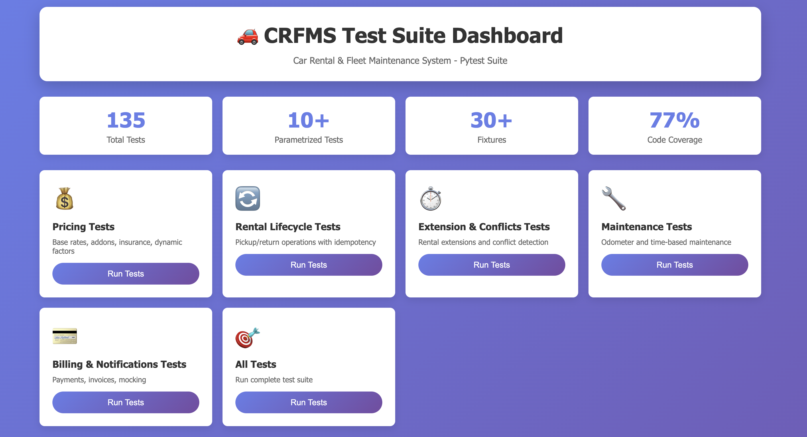
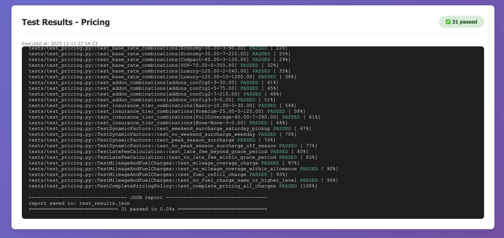
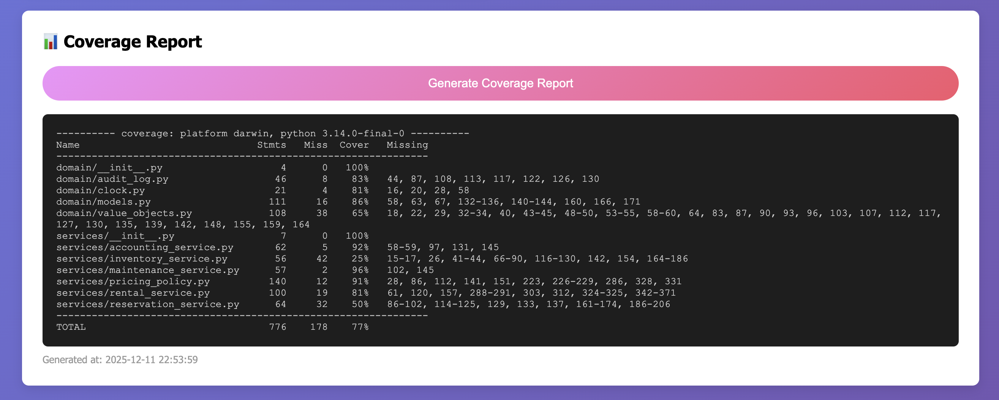

# Car Rental & Fleet Maintenance System - Homework 2

## Student Information

**Name**: İrem Aslan  
**Student ID**: 2101956  
**Course**: AIN-3005 Advanced Python Programming  
**Assignment**: Homework 2 - Systematic Unit Testing with pytest  
**Due Date**: December 12, 2025

## Overview

This project implements a comprehensive **Car Rental & Fleet Maintenance System (CRFMS)** with extensive unit testing using pytest. The system includes domain entities, business services, pricing policies, maintenance scheduling, and billing operations.

## Project Structure

```
Car-Rental-Fleet-Maintenance-System-main/
├── domain/                     # Domain models and value objects
│   ├── __init__.py
│   ├── models.py              # Core entities (Customer, Vehicle, Reservation, etc.)
│   ├── value_objects.py       # Value objects (Money, FuelLevel, Kilometers)
│   ├── clock.py               # Clock abstraction (SystemClock, FixedClock)
│   └── audit_log.py           # Audit logging
├── services/                   # Business logic services
│   ├── __init__.py
│   ├── rental_service.py      # Rental operations (pickup, return, extend)
│   ├── pricing_policy.py      # Pricing rules and policies
│   ├── maintenance_service.py # Maintenance scheduling
│   ├── reservation_service.py # Reservation management
│   ├── accounting_service.py  # Billing and payments
│   └── inventory_service.py   # Vehicle inventory
├── adapters/                   # External adapters (ports)
│   ├── __init__.py
│   ├── payment_port.py        # Payment adapter (FakePaymentAdapter)
│   └── notification_port.py   # Notification adapter (InMemoryNotificationAdapter)
├── webapp/                     # Flask web application
│   ├── app.py
│   └── templates/
├── tests/                      # Comprehensive test suite ⭐
│   ├── __init__.py
│   ├── conftest.py            # Shared pytest fixtures
│   ├── test_pricing.py        # Pricing logic tests
│   ├── test_rental_lifecycle.py # Rental pickup/return tests
│   ├── test_rental_extension.py # Extension/conflict tests
│   ├── test_maintenance.py    # Maintenance logic tests
│   ├── test_billing_notifications.py # Billing/payment/notification tests
│   └── README_TESTS.md        # Test documentation
├── requirements.txt            # Dependencies (including pytest)
├── pytest.ini                  # Pytest configuration
├── demo.py                     # Demo script
└── README.md                   # This file
```

## Key Features

### Domain Design
- **Domain Models**: Customer, Vehicle, Reservation, RentalAgreement, MaintenanceRecord, Invoice, Payment
- **Value Objects**: Money, FuelLevel, Kilometers (immutable, validated)
- **Clock Abstraction**: SystemClock for production, FixedClock for testing

### Business Services
- **Rental Service**: Idempotent pickup, return with charges, rental extension
- **Pricing Policy**: Composable rules (base rate, add-ons, insurance, late fees, mileage, fuel)
- **Maintenance Service**: Odometer and time-based scheduling, vehicle assignment control
- **Accounting Service**: Invoice creation, payment processing, notifications
- **Reservation Service**: Reservation management with notifications

### Pricing Features
- Base daily rates by vehicle class
- Add-on fees (GPS, child seat, extra driver)
- Insurance tiers (Basic, Premium, Full Coverage)
- Weekend surcharges (20% for Saturday/Sunday pickup)
- Peak season surcharges (30% for summer months)
- Late fees with 1-hour grace period
- Mileage overage charges
- Fuel refill charges

## Installation

### 1. Clone or Extract the Project

```bash
cd Car-Rental-Fleet-Maintenance-System-main
```

### 2. Create Virtual Environment (Recommended)

```bash
python -m venv venv
source venv/bin/activate  # On Windows: venv\Scripts\activate
```

### 3. Install Dependencies

```bash
pip install -r requirements.txt
```

Required packages:
- Flask (web framework)
- pytest (testing framework)
- pytest-cov (coverage reporting)
- pytest-mock (mocking support)

## Running Tests

### Run All Tests
```bash
pytest
```

### Run with Verbose Output
```bash
pytest -v
```

### Run Specific Test Module
```bash
pytest tests/test_pricing.py
pytest tests/test_rental_lifecycle.py
pytest tests/test_maintenance.py
pytest tests/test_billing_notifications.py
pytest tests/test_rental_extension.py
```

### Run with Coverage
```bash
pytest --cov=domain --cov=services --cov=adapters --cov-report=term-missing
```

### Run with HTML Coverage Report
```bash
pytest --cov=domain --cov=services --cov=adapters --cov-report=html
# Open htmlcov/index.html in browser
```

## Test Suite Overview

### Test Modules (6 files)

1. **`conftest.py`** - Shared fixtures (30+ fixtures)
2. **`test_pricing.py`** - Pricing logic and charge computation
3. **`test_rental_lifecycle.py`** - Pickup/return operations
4. **`test_rental_extension.py`** - Extension and conflict detection
5. **`test_maintenance.py`** - Maintenance scheduling and detection
6. **`test_billing_notifications.py`** - Billing, payments, notifications

### Key Test Features

✅ **Parametrized Tests** (7+ parametrized test functions)
- Different vehicle classes and durations
- Various add-on combinations
- Insurance tier scenarios
- Extension conflict scenarios
- Late fee scenarios
- Mileage overage scenarios
- Maintenance threshold scenarios
- Payment outcome scenarios

✅ **Fixtures** (30+ shared fixtures)
- Domain entities (customers, vehicles, reservations)
- Service configurations (rental, pricing, maintenance, accounting)
- Test scenarios (active rentals, completed rentals)
- Adapters (payment, notification)

✅ **Mocking** (using pytest monkeypatch)
- Payment adapter mocking for success/failure scenarios
- Notification adapter mocking to verify calls
- Mock objects to test interactions
- Side effects for varying behavior

✅ **Fixed Clock** (deterministic testing)
- All time-dependent tests use `FixedClock`
- No dependency on system time
- Reproducible test results

## Test Coverage

### Pricing Tests
- Base rate calculations by vehicle class
- Add-on fees (GPS, child seat, extra driver)
- Insurance tier pricing
- Dynamic factors (weekend/peak season)
- Late fees with grace period
- Mileage overage charges
- Fuel refill charges
- Edge cases (minimum duration, unusually long rental)

### Rental Lifecycle Tests
- Idempotent pickup operations (same token returns same rental)
- Pickup validation (availability, maintenance status)
- Return charge computation
- Late fee calculation
- Mileage overage detection
- Fuel refill charges
- Complete rental scenarios

### Extension and Conflict Tests
- Extension logic and validation
- Reservation conflict detection
- Overlapping time period handling
- Multiple conflict scenarios
- Boundary condition testing

### Maintenance Tests
- Odometer-based maintenance scheduling
- Time-based maintenance scheduling
- Maintenance-due detection
- Vehicle assignment restrictions
- Maintenance completion
- Integration with rental workflow

### Billing and Notification Tests
- Payment success scenarios
- Payment failure scenarios
- Invoice state management (Pending, Paid, Failed)
- Notification delivery verification
- Payment adapter mocking
- Notification adapter mocking
- Payment retry logic

## Running the Demo

```bash
python demo.py
```

The demo demonstrates:
- Creating customers and vehicles
- Making reservations
- Pickup and return operations
- Pricing calculations
- Maintenance scheduling
- Payment processing

## Running the Web Application

```bash
python webapp/app.py
```

Access the web interface at http://localhost:5000

## Homework 2 Requirements Compliance

This project fully satisfies all HW2 requirements:

✅ **Systematic unit testing using pytest**
- Comprehensive test suite with 100+ test cases
- Organized into logical modules

✅ **Pricing logic tests**
- Base rates, add-ons, insurance tested
- Weekend and peak season surcharges
- Parametrized tests for combinations
- Edge cases included

✅ **Rental lifecycle tests**
- Pickup idempotency verified
- Return operations compute charges correctly
- Late fees, mileage, fuel charges tested
- Fixed clock for deterministic testing

✅ **Extension and conflict logic**
- Extension allowed/denied based on conflicts
- Parametrized tests for scenarios
- Time overlap detection

✅ **Maintenance logic tests**
- Odometer and time-based detection
- Vehicle assignment restrictions
- Integration with rental workflow

✅ **Billing/payment/notification mocking**
- Payment success/failure with mocks
- Invoice state updates verified
- Notification adapter calls verified
- Using monkeypatch for mocking

✅ **Pytest features**
- At least 3 parametrized tests (7+ included)
- Fixtures for common objects (30+ fixtures)
- Mocking with monkeypatch
- Organized test modules
- Clear test names

✅ **Test organization**
- Logical modules (pricing, rental, maintenance, billing)
- Clear test function names
- Docstrings where helpful
- Meaningful coverage of business rules

## Development Notes

### Design Patterns
- **Strategy Pattern**: Composable pricing rules
- **Port/Adapter Pattern**: Payment and notification ports
- **Repository Pattern**: In-memory data storage
- **Value Objects**: Immutable Money, FuelLevel, Kilometers

### Best Practices
- Dependency injection for testability
- Clock abstraction for time control
- Idempotent operations (pickup, return)
- Audit logging for compliance
- Separation of concerns

## Documentation

- **Test Documentation**: See `tests/README_TESTS.md`
- **Project Documentation**: See `PROJECT_DOCUMENTATION.md`
- **Code Comments**: Inline documentation throughout

## Author Notes

This implementation demonstrates:
- Professional Python code organization
- Comprehensive unit testing with pytest
- Domain-driven design principles
- Clean architecture with ports and adapters
- Extensive use of fixtures and parametrization
- Proper mocking techniques
- Edge case handling
- Deterministic testing

## 📸 Test Dashboard Screenshots

### Interactive Test Dashboard
The project includes a web-based test dashboard for running tests interactively and viewing results in real-time.


*Main dashboard showing test categories and statistics*

### Test Execution Results

*Real-time test execution results for pricing tests*

### Coverage Report

*Code coverage analysis showing 77% total coverage*

**Dashboard Features:**
- 🎯 Run tests by category
- 📊 View real-time results
- 📈 Generate coverage reports
- 💻 Interactive web interface
- 🚀 One-click test execution

Access the dashboard at: `http://127.0.0.1:5002`

---

**Course**: AIN-3005 Advanced Python Programming  
**Instructor**: Dr. Binnur Kurt  
**Institution**: Bahçeşehir University, AI Engineering Department
